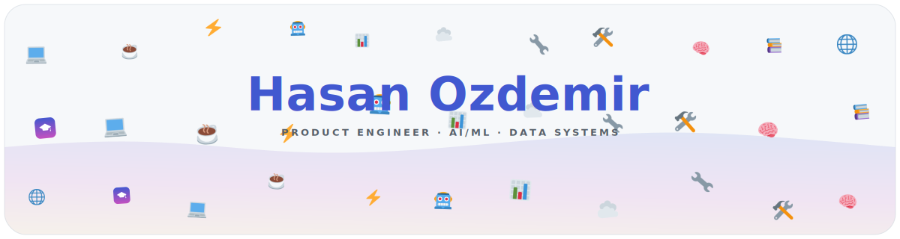

<picture>
  <source media="(prefers-color-scheme: dark)" srcset="assets/generated/banner-header-dark.svg">
  
</picture>

 

&nbsp;
&nbsp;

 

<samp>
<b>Software evangelizer</b> with a passion for AI/ML, Automation, Knowledge Management, Data Processing — committed to building apps and tools that make a meaningful change.
</samp>

 

<picture>
  <source media="(prefers-color-scheme: dark)" srcset="https://streak-stats.demolab.com/?user=yoshibase&theme=radical&hide_border=true&card_width=300&card_height=120">
  
</picture>

 

<picture>
  <source media="(prefers-color-scheme: dark)" srcset="assets/generated/tech-stack-dark.svg">
  
</picture>

 

<!--TRENDING_START-->

<h3>🔥 Trending Today</h3>

<table style="border-collapse:collapse;font-family:Inter,sans-serif;width:100%;max-width:900px;margin:0 auto">
<tr style="background:linear-gradient(135deg,#4158D0,#C850C0);color:#fff;font-size:10px">
<th style="padding:6px 10px">#</th>
<th style="padding:6px 10px"></th>
<th style="padding:6px 10px;text-align:left">Repo</th>
<th style="padding:6px 10px;text-align:left">Description</th>
<th style="padding:6px 10px;text-align:right">Stats</th>
</tr>
<tr><td style="text-align:center;font-size:11px;font-weight:600;color:#C850C0">#1</td><td style="font-size:12px">🌍 🤖</td><td style="font-size:11px"><a href="https://github.com/DietrichGebert/ponytail"><b>DietrichGebert/ponytail</b></a></td><td style="font-size:10px;color:#8B949E">Makes your AI agent think like the laziest senior dev in the room. The best code is the code you never wrote.</td><td style="text-align:right;font-size:10px;color:#C850C0">⭐86.7k 🍴4.7k</td></tr><tr><td style="text-align:center;font-size:11px;font-weight:600;color:#C850C0">#2</td><td style="font-size:12px">🇺🇸 🧠</td><td style="font-size:11px"><a href="https://github.com/xai-org/grok-build"><b>xai-org/grok-build</b></a></td><td style="font-size:10px;color:#8B949E">SpaceXAI's coding agent harness and TUI. Fullscreen, mouse interactive, extensible.</td><td style="text-align:right;font-size:10px;color:#C850C0">⭐20.9k 🍴3.9k</td></tr><tr><td style="text-align:center;font-size:11px;font-weight:600;color:#C850C0">#3</td><td style="font-size:12px">🌍 🧬</td><td style="font-size:11px"><a href="https://github.com/JustVugg/colibri"><b>JustVugg/colibri</b></a></td><td style="font-size:10px;color:#8B949E">Run GLM-5.2 (744B MoE) on a 25GB-RAM consumer machine — pure C, zero deps, experts streamed from disk. Tiny engine, immense model. 🐦</td><td style="text-align:right;font-size:10px;color:#C850C0">⭐17.0k 🍴1.6k</td></tr>
</table>

<!--TRENDING_END-->

 

<!--REPO_OF_DAY_START-->

<h3>📦 Repo of the Day — Last 30 Days</h3>

<table style="border-collapse:separate;border-spacing:6px;font-family:Inter,sans-serif;width:100%;max-width:1000px;margin:0 auto">
<tr><td style="padding:8px;border:1px solid #30363D;border-radius:8px;vertical-align:top;width:33%">
Jul 21

🌍 🧬 <a href="https://github.com/JustVugg/colibri"><b>JustVugg/colibri</b></a>

Run GLM-5.2 (744B MoE) on a 25GB-RAM consumer machine — pure C, zero deps, experts streamed from disk. Tiny engine, immense model. 🐦

⭐17.0k
</td><td style="padding:8px;border:1px solid #30363D;border-radius:8px;vertical-align:top;width:33%">
Jul 8

🌍 🤖 <a href="https://github.com/DietrichGebert/ponytail"><b>DietrichGebert/ponytail</b></a>

Makes your AI agent think like the laziest senior dev in the room — the best code is the code you don't write.

⭐77k
</td><td style="padding:8px;border:1px solid #30363D;border-radius:8px;vertical-align:top;width:33%">
Jul 7

🇨🇳 🤖 <a href="https://github.com/baidu/Unlimited-OCR"><b>baidu/Unlimited-OCR</b></a>

Unlimited OCR Works: welcome the era of one-shot long-horizon parsing.

⭐14k
</td></tr><tr><td style="padding:8px;border:1px solid #30363D;border-radius:8px;vertical-align:top;width:33%">
Jul 6

🌍 🧠 <a href="https://github.com/XiaomiMiMo/MiMo-Code"><b>XiaomiMiMo/MiMo-Code</b></a>

MiMo Code: where models and agents co-evolve.

⭐12k
</td><td style="padding:8px;border:1px solid #30363D;border-radius:8px;vertical-align:top;width:33%">
Jul 5

🇺🇸 🤖 <a href="https://github.com/langchain-ai/openwiki"><b>langchain-ai/openwiki</b></a>

A CLI that writes and maintains agent documentation for your codebase.

⭐9.5k
</td><td style="padding:8px;border:1px solid #30363D;border-radius:8px;vertical-align:top;width:33%">
Jul 4

🌍 🧬 <a href="https://github.com/unicity-astrid/book"><b>unicity-astrid/book</b></a>

The canonical reference for Astrid OS: kernel, capsules, host ABI, the bus, and the security model.

⭐7.5k
</td></tr><tr><td style="padding:8px;border:1px solid #30363D;border-radius:8px;vertical-align:top;width:33%">
Jul 3

🌍 🗄️ <a href="https://github.com/unicity-astrid/handbook"><b>unicity-astrid/handbook</b></a>

How to work on Astrid: the polyrepo, the kernel-is-dumb law, the RFC trigger, contribution guide.

⭐7.5k
</td><td style="padding:8px;border:1px solid #30363D;border-radius:8px;vertical-align:top;width:33%">
Jul 2

🌍 ⚡ <a href="https://github.com/shadcn/improve"><b>shadcn/improve</b></a>

Use your most capable model to audit your codebase and write plans for cheaper models to execute.

⭐7.5k
</td><td style="padding:8px;border:1px solid #30363D;border-radius:8px;vertical-align:top;width:33%">
Jul 1

🇺🇸 🤖 <a href="https://github.com/omnigent-ai/omnigent"><b>omnigent-ai/omnigent</b></a>

Open-source AI agent framework and meta-harness: orchestrate Claude Code, Codex, and more.

⭐6.7k
</td></tr><tr><td style="padding:8px;border:1px solid #30363D;border-radius:8px;vertical-align:top;width:33%">
Jun 30

🌍 🤖 <a href="https://github.com/cobusgreyling/loop-engineering"><b>cobusgreyling/loop-engineering</b></a>

Practical patterns, starters & CLI tools for loop engineering with AI coding agents.

⭐6.5k
</td><td style="padding:8px;border:1px solid #30363D;border-radius:8px;vertical-align:top;width:33%">
Jun 29

🌍 🤖 <a href="https://github.com/deepseek-ai/DeepSpec"><b>deepseek-ai/DeepSpec</b></a>

A full-stack codebase for training and evaluating speculative decoding algorithms.

⭐6.4k
</td><td style="padding:8px;border:1px solid #30363D;border-radius:8px;vertical-align:top;width:33%">
Jun 28

🇺🇸 ⚡ <a href="https://github.com/diffusionstudio/lottie"><b>diffusionstudio/lottie</b></a>

Generate production-ready Lottie animations with Claude Code or Codex.

⭐4.6k
</td></tr><tr><td style="padding:8px;border:1px solid #30363D;border-radius:8px;vertical-align:top;width:33%">
Jun 27

🌍 📦 <a href="https://github.com/zhongerxin/Cowart"><b>zhongerxin/Cowart</b></a>

A compact, fast-moving JavaScript toolkit.

⭐4.1k
</td><td style="padding:8px;border:1px solid #30363D;border-radius:8px;vertical-align:top;width:33%">
Jun 26

🌍 📦 <a href="https://github.com/makerspet/oomwoo"><b>makerspet/oomwoo</b></a>

Open-source vacuum robot cleaner.

⭐3.9k
</td><td style="padding:8px;border:1px solid #30363D;border-radius:8px;vertical-align:top;width:33%">
Jun 25

🌍 🔍 <a href="https://github.com/bikini/exploitarium"><b>bikini/exploitarium</b></a>

A single archive of public exploit PoCs and vulnerability research writeups.

⭐3.8k
</td></tr><tr><td style="padding:8px;border:1px solid #30363D;border-radius:8px;vertical-align:top;width:33%">
Jun 24

🌍 🧠 <a href="https://github.com/elder-plinius/T3MP3ST"><b>elder-plinius/T3MP3ST</b></a>

Autonomous red teaming platform; multi-agent offensive-security meta-harness.

⭐3.6k
</td><td style="padding:8px;border:1px solid #30363D;border-radius:8px;vertical-align:top;width:33%">
Jun 23

🌍 🧠 <a href="https://github.com/BuilderIO/skills"><b>BuilderIO/skills</b></a>

Skills for coding agents.

⭐3.5k
</td><td style="padding:8px;border:1px solid #30363D;border-radius:8px;vertical-align:top;width:33%">
Jun 22

🌍 📱 <a href="https://github.com/Yu9191/wloc"><b>Yu9191/wloc</b></a>

Override Apple network location (gs-loc) coordinates — Surge / Quantumult X / Loon / Stash.

⭐3.3k
</td></tr><tr><td style="padding:8px;border:1px solid #30363D;border-radius:8px;vertical-align:top;width:33%">
Jun 21

🌍 🧠 <a href="https://github.com/vercel/eve"><b>vercel/eve</b></a>

The framework for building agents.

⭐3.3k
</td><td style="padding:8px;border:1px solid #30363D;border-radius:8px;vertical-align:top;width:33%">
Jun 20

🌍 🤖 <a href="https://github.com/baairon/torlink"><b>baairon/torlink</b></a>

A sleek, zero-setup torrent finder and downloader that lives right in your terminal.

⭐3.3k
</td><td style="padding:8px;border:1px solid #30363D;border-radius:8px;vertical-align:top;width:33%">
Jun 19

🌍 🤖 <a href="https://github.com/Waishnav/devspace"><b>Waishnav/devspace</b></a>

Turn ChatGPT into Codex, or turn Claude web into Claude Code.

⭐3.1k
</td></tr><tr><td style="padding:8px;border:1px solid #30363D;border-radius:8px;vertical-align:top;width:33%">
Jun 18

🌍 ⚡ <a href="https://github.com/bozhouDev/codex-orange-book"><b>bozhouDev/codex-orange-book</b></a>

A full end-to-end unofficial guide to Codex, install to real-world case studies.

⭐2.7k
</td><td style="padding:8px;border:1px solid #30363D;border-radius:8px;vertical-align:top;width:33%">
Jun 17

🌍 🌐 <a href="https://github.com/tamnd/kage"><b>tamnd/kage</b></a>

Shadow any website for offline viewing, with the JavaScript stripped out.

⭐2.7k
</td><td style="padding:8px;border:1px solid #30363D;border-radius:8px;vertical-align:top;width:33%">
Jun 16

🌍 🤖 <a href="https://github.com/Forward-Future/loopy"><b>Forward-Future/loopy</b></a>

A library of practical AI-agent loops and an installable skill for finding and adapting them.

⭐2.5k
</td></tr><tr><td style="padding:8px;border:1px solid #30363D;border-radius:8px;vertical-align:top;width:33%">
Jun 15

🌍 🤖 <a href="https://github.com/JimLiu/baoyu-design"><b>JimLiu/baoyu-design</b></a>

Run Claude Design locally as an Agent Skill — Cursor, Claude Code & more.

⭐2.5k
</td><td style="padding:8px;border:1px solid #30363D;border-radius:8px;vertical-align:top;width:33%">
Jun 14

🌍 🤖 <a href="https://github.com/vorssaint/vorssaint-utils"><b>vorssaint/vorssaint-utils</b></a>

Free open-source macOS menu bar toolkit — volume mixer, system monitor, dock preview.

⭐2.5k
</td><td style="padding:8px;border:1px solid #30363D;border-radius:8px;vertical-align:top;width:33%">
Jun 13

🇸🇬 🧠 <a href="https://github.com/cloudflare/security-audit-skill"><b>cloudflare/security-audit-skill</b></a>

A coding-agent skill for multi-phase security audits with independently verified findings.

⭐2.3k
</td></tr><tr><td style="padding:8px;border:1px solid #30363D;border-radius:8px;vertical-align:top;width:33%">
Jun 12

🇺🇸 🤖 <a href="https://github.com/TestSprite/testsprite-cli"><b>TestSprite/testsprite-cli</b></a>

Official TestSprite CLI — AI-powered automated testing from your terminal.

⭐2.2k
</td><td style="padding:8px;border:1px solid #30363D;border-radius:8px;vertical-align:top;width:33%">
Jun 11

🌍 🤖 <a href="https://github.com/lenucksi/aur-malware-check"><b>lenucksi/aur-malware-check</b></a>

Detection tools for the June 2026 atomic-lockfile AUR supply-chain attack.

⭐2.0k
</td><td style="padding:8px;border:1px solid #30363D;border-radius:8px;vertical-align:top;width:33%">
Jun 10

🌍 🤖 <a href="https://github.com/shy3130/tickflow-stock-panel"><b>shy3130/tickflow-stock-panel</b></a>

Self-hosted, zero-ops A-share stock picking, monitoring and backtesting workbench.

⭐1.9k
</td></tr>
</table>

Last synced Jul 21, 2026 · automated daily

<!--REPO_OF_DAY_END-->

 

<picture>
  <source media="(prefers-color-scheme: dark)" srcset="assets/generated/banner-footer-dark.svg">
  
</picture>

<!--SYNCED_AT_START-->
<!-- synced: 2026-07-21 02:49 UTC -->
<!--SYNCED_AT_END-->
