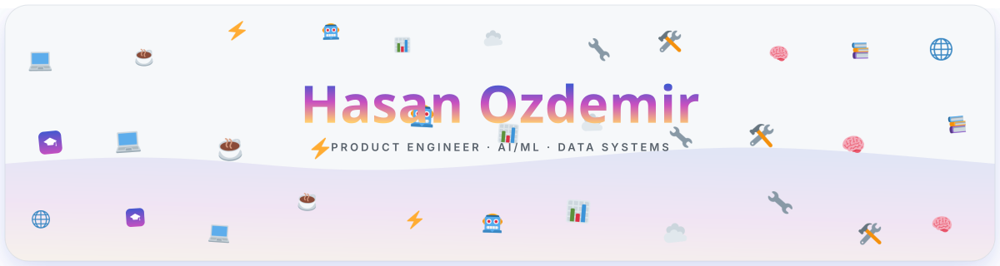
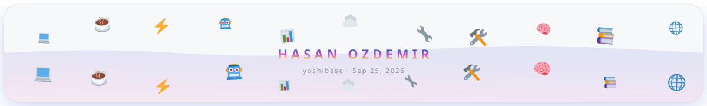

<picture>
  <source media="(prefers-color-scheme: dark)" srcset="assets/generated/banner-header-dark.svg">
  
</picture>

 

&nbsp;
&nbsp;

 

<samp>
<b>Software evangelizer</b> with a passion for AI/ML, Automation, Knowledge Management, Data Processing — committed to building apps and tools that make a meaningful change.
</samp>

 

<picture>
  <source media="(prefers-color-scheme: dark)" srcset="https://streak-stats.demolab.com/?user=yoshibase&theme=radical&hide_border=true&card_width=300&card_height=120">
  
</picture>

 

<picture>
  <source media="(prefers-color-scheme: dark)" srcset="assets/generated/tech-stack-dark.svg">
  
</picture>

 

<!--TRENDING_START-->

<h3>🔥 Trending Today</h3>

<table style="border-collapse:collapse;font-family:Inter,sans-serif;width:100%;max-width:900px;margin:0 auto">
<tr style="background:linear-gradient(135deg,#4158D0,#C850C0);color:#fff;font-size:10px">
<th style="padding:6px 10px">#</th>
<th style="padding:6px 10px"></th>
<th style="padding:6px 10px;text-align:left">Repo</th>
<th style="padding:6px 10px;text-align:left">Description</th>
<th style="padding:6px 10px;text-align:right">Stats</th>
</tr>
<tr><td style="text-align:center;font-size:11px;font-weight:600;color:#C850C0">#1</td><td style="font-size:12px">🇺🇸 🐍</td><td style="font-size:11px"><a href="https://github.com/firecrawl/anydoc"><b>firecrawl/anydoc</b></a></td><td style="font-size:10px;color:#8B949E">Convert Word, PowerPoint, Excel, OpenDocument, RTF, EPUB, CSV, and PDF to clean Markdown. Built in Rust, with Node.js and Python bindings.</td><td style="text-align:right;font-size:10px;color:#C850C0">⭐15.1k 🍴806 +637 today</td></tr><tr><td style="text-align:center;font-size:11px;font-weight:600;color:#C850C0">#2</td><td style="font-size:12px">🌍 📦</td><td style="font-size:11px"><a href="https://github.com/ZzzLc0405/photo-abstract-editorial"><b>ZzzLc0405/photo-abstract-editorial</b></a></td><td style="font-size:10px;color:#8B949E"></td><td style="text-align:right;font-size:10px;color:#C850C0">⭐3.1k 🍴180 +528 today</td></tr><tr><td style="text-align:center;font-size:11px;font-weight:600;color:#C850C0">#3</td><td style="font-size:12px">🌍 📦</td><td style="font-size:11px"><a href="https://github.com/Zeejay0/gathered-scenes-zine-skill"><b>Zeejay0/gathered-scenes-zine-skill</b></a></td><td style="font-size:10px;color:#8B949E"></td><td style="text-align:right;font-size:10px;color:#C850C0">⭐3.1k 🍴348 +504 today</td></tr>
</table>

<!--TRENDING_END-->

 

<!--REPO_OF_DAY_START-->

<h3>📦 Repo of the Day — Last 30 Days</h3>

<table style="border-collapse:separate;border-spacing:6px;font-family:Inter,sans-serif;width:100%;max-width:1000px;margin:0 auto">
<tr><td style="padding:8px;border:1px solid #30363D;border-radius:8px;vertical-align:top;width:33%">
Aug 13

🌍 🔧 <a href="https://github.com/FareedKhan-dev/kimi-k3-in-c"><b>FareedKhan-dev/kimi-k3-in-c</b></a>

A 2.78-trillion-parameter Kimi K3 running inference on a single CPU in 8.24 GB of RAM. Portable C99: no BLAS, no framework, no GPU.

⭐5.2k
</td><td style="padding:8px;border:1px solid #30363D;border-radius:8px;vertical-align:top;width:33%">
Aug 12

🇺🇸 🐍 <a href="https://github.com/firecrawl/anydoc"><b>firecrawl/anydoc</b></a>

Convert Word, PowerPoint, Excel, OpenDocument, RTF, EPUB, CSV, and PDF to clean Markdown. Built in Rust, with Node.js and Python bindings.

⭐14.5k
</td><td style="padding:8px;border:1px solid #30363D;border-radius:8px;vertical-align:top;width:33%">
Aug 11

🌍 📱 <a href="https://github.com/microsoft/skill-recorder"><b>microsoft/skill-recorder</b></a>

Desktop app that records your on-screen work session and uses the GitHub Copilot CLI to reconstruct it as an intent + ordered steps, then builds a reusable Skill or Automation for Microsoft Scout, Microsoft Copilot Cowork, or Copilot Studio.

⭐2.8k
</td></tr><tr><td style="padding:8px;border:1px solid #30363D;border-radius:8px;vertical-align:top;width:33%">
Aug 10

🌍 📦 <a href="https://github.com/x4gKing/X4G"><b>x4gKing/X4G</b></a>

⭐8.4k
</td><td style="padding:8px;border:1px solid #30363D;border-radius:8px;vertical-align:top;width:33%">
Aug 9

🌍 📦 <a href="https://github.com/bashalarmistalt/decimen-optical-transfer"><b>bashalarmistalt/decimen-optical-transfer</b></a>

⭐5.3k
</td><td style="padding:8px;border:1px solid #30363D;border-radius:8px;vertical-align:top;width:33%">
Aug 8

🌍 🤖 <a href="https://github.com/Vincentwei1021/video-shotcraft"><b>Vincentwei1021/video-shotcraft</b></a>

AI video skill for Claude Code & Codex — cinematic product videos with Remotion: 106 shot recipe cards, 161 motion previews, a production-ready template

⭐4.0k
</td></tr><tr><td style="padding:8px;border:1px solid #30363D;border-radius:8px;vertical-align:top;width:33%">
Aug 7

🇺🇸 🤖 <a href="https://github.com/trycompai/crm"><b>trycompai/crm</b></a>

Comp AI CRM is an open source, CRM designed for AI agents. Agentic-first CRM.

⭐7.2k
</td><td style="padding:8px;border:1px solid #30363D;border-radius:8px;vertical-align:top;width:33%">
Aug 6

🌍 📦 <a href="https://github.com/xdash/FDE-the-Guidance-Book-of-Forward-Deployed-Engineer"><b>xdash/FDE-the-Guidance-Book-of-Forward-Deployed-Engineer</b></a>

FDE（前沿部署工程师）从零入门指南（基于范冰《增长黑客》原书框架）

⭐3.4k
</td><td style="padding:8px;border:1px solid #30363D;border-radius:8px;vertical-align:top;width:33%">
Aug 5

🌍 📦 <a href="https://github.com/LiamGvchi/gc-minimal-zine-poster"><b>LiamGvchi/gc-minimal-zine-poster</b></a>

Codex skill for generating quiet minimal zine-style editorial poster prompts and images.

⭐3.0k
</td></tr><tr><td style="padding:8px;border:1px solid #30363D;border-radius:8px;vertical-align:top;width:33%">
Aug 4

🇬🇧 📦 <a href="https://github.com/drumih/turbo-fieldfare"><b>drumih/turbo-fieldfare</b></a>

Gemma 4 26B-A4B inference in ~2 GB of RAM on any M-series MacBook

⭐4.6k
</td><td style="padding:8px;border:1px solid #30363D;border-radius:8px;vertical-align:top;width:33%">
Aug 3

🌍 📦 <a href="https://github.com/andrewyng/openworker"><b>andrewyng/openworker</b></a>

⭐12.1k
</td><td style="padding:8px;border:1px solid #30363D;border-radius:8px;vertical-align:top;width:33%">
Aug 2

🇺🇸 🧠 <a href="https://github.com/yc-software/qm"><b>yc-software/qm</b></a>

Multiplayer agent harness for work

⭐5.1k
</td></tr><tr><td style="padding:8px;border:1px solid #30363D;border-radius:8px;vertical-align:top;width:33%">
Aug 1

🌍 💻 <a href="https://github.com/openai/codex-security"><b>openai/codex-security</b></a>

OpenAI's Codex Security CLI and TypeScript SDK for finding, validating, and fixing security vulnerabilities. npm: https://www.npmjs.com/package/@openai/codex-security

⭐7.8k
</td><td style="padding:8px;border:1px solid #30363D;border-radius:8px;vertical-align:top;width:33%">
Jul 31

🌍 📦 <a href="https://github.com/oso95/scroll-world"><b>oso95/scroll-world</b></a>

A skill that turn any brand into a scrollable 3D world

⭐6.0k
</td><td style="padding:8px;border:1px solid #30363D;border-radius:8px;vertical-align:top;width:33%">
Jul 30

🌍 ⚡ <a href="https://github.com/img2threejs/img2threejs"><b>img2threejs/img2threejs</b></a>

Rebuild the object in a reference image as a code-only, procedural, quality-gated, animation-ready Three.js model. Token-efficient image-to-3D.

⭐8.2k
</td></tr><tr><td style="padding:8px;border:1px solid #30363D;border-radius:8px;vertical-align:top;width:33%">
Jul 29

🌍 📦 <a href="https://github.com/MoonshotAI/Kimi-K3"><b>MoonshotAI/Kimi-K3</b></a>

Open Frontier Intelligence

⭐3.5k
</td><td style="padding:8px;border:1px solid #30363D;border-radius:8px;vertical-align:top;width:33%">
Jul 28

🇨🇳 🔍 <a href="https://github.com/baidu/Unlimited-OCR"><b>baidu/Unlimited-OCR</b></a>

Unlimited OCR Works: Welcome the Era of One-shot Long-horizon Parsing.

⭐19.7k
</td><td style="padding:8px;border:1px solid #30363D;border-radius:8px;vertical-align:top;width:33%">
Jul 27

🌍 🧬 <a href="https://github.com/JustVugg/colibri"><b>JustVugg/colibri</b></a>

Run GLM-5.2 (744B MoE) on a 25GB-RAM consumer machine — pure C, zero deps, experts streamed from disk. Tiny engine, immense model. 🐦

⭐19.7k
</td></tr><tr><td style="padding:8px;border:1px solid #30363D;border-radius:8px;vertical-align:top;width:33%">
Jul 26

🌍 🤖 <a href="https://github.com/DietrichGebert/ponytail"><b>DietrichGebert/ponytail</b></a>

Makes your AI agent think like the laziest senior dev in the room. The best code is the code you never wrote.

⭐89.4k
</td><td style="padding:8px;border:1px solid #30363D;border-radius:8px;vertical-align:top;width:33%">
Jul 25

No pick
</td><td style="padding:8px;border:1px solid #30363D;border-radius:8px;vertical-align:top;width:33%">
Jul 24

No pick
</td></tr><tr><td style="padding:8px;border:1px solid #30363D;border-radius:8px;vertical-align:top;width:33%">
Jul 23

No pick
</td><td style="padding:8px;border:1px solid #30363D;border-radius:8px;vertical-align:top;width:33%">
Jul 22

No pick
</td><td style="padding:8px;border:1px solid #30363D;border-radius:8px;vertical-align:top;width:33%">
Jul 21

No pick
</td></tr><tr><td style="padding:8px;border:1px solid #30363D;border-radius:8px;vertical-align:top;width:33%">
Jul 20

No pick
</td><td style="padding:8px;border:1px solid #30363D;border-radius:8px;vertical-align:top;width:33%">
Jul 19

No pick
</td><td style="padding:8px;border:1px solid #30363D;border-radius:8px;vertical-align:top;width:33%">
Jul 18

No pick
</td></tr><tr><td style="padding:8px;border:1px solid #30363D;border-radius:8px;vertical-align:top;width:33%">
Jul 17

No pick
</td><td style="padding:8px;border:1px solid #30363D;border-radius:8px;vertical-align:top;width:33%">
Jul 16

No pick
</td><td style="padding:8px;border:1px solid #30363D;border-radius:8px;vertical-align:top;width:33%">
Jul 15

No pick
</td></tr>
</table>

Last synced Aug 13, 2026 · automated daily

<!--REPO_OF_DAY_END-->

 

<picture>
  <source media="(prefers-color-scheme: dark)" srcset="assets/generated/banner-footer-dark.svg">
  
</picture>

<!--SYNCED_AT_START-->
<!-- synced: 2026-08-13 01:38 UTC -->
<!--SYNCED_AT_END-->
