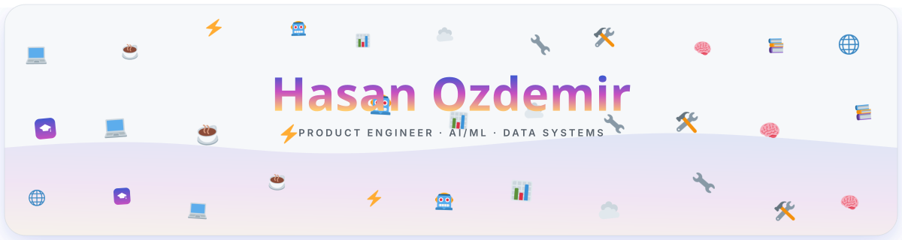

<picture>
  <source media="(prefers-color-scheme: dark)" srcset="assets/generated/banner-header-dark.svg">
  
</picture>

 

&nbsp;
&nbsp;

 

<samp>
<b>Software evangelizer</b> with a passion for AI/ML, Automation, Knowledge Management, Data Processing — committed to building apps and tools that make a meaningful change.
</samp>

 

<picture>
  <source media="(prefers-color-scheme: dark)" srcset="https://streak-stats.demolab.com/?user=yoshibase&theme=radical&hide_border=true&card_width=300&card_height=120">
  
</picture>

 

<picture>
  <source media="(prefers-color-scheme: dark)" srcset="assets/generated/tech-stack-dark.svg">
  
</picture>

 

<!--TRENDING_START-->

<h3>🔥 Trending Today</h3>

<table style="border-collapse:collapse;font-family:Inter,sans-serif;width:100%;max-width:900px;margin:0 auto">
<tr style="background:linear-gradient(135deg,#4158D0,#C850C0);color:#fff;font-size:10px">
<th style="padding:6px 10px">#</th>
<th style="padding:6px 10px"></th>
<th style="padding:6px 10px;text-align:left">Repo</th>
<th style="padding:6px 10px;text-align:left">Description</th>
<th style="padding:6px 10px;text-align:right">Stats</th>
</tr>
<tr><td style="text-align:center;font-size:11px;font-weight:600;color:#C850C0">#1</td><td style="font-size:12px">🌍 📦</td><td style="font-size:11px"><a href="https://github.com/eternity4719/HowToLiveBetter"><b>eternity4719/HowToLiveBetter</b></a></td><td style="font-size:10px;color:#8B949E">按性价比排序的循证生活指南：长寿防病、急救、省钱理财、法律红线、失业与工伤、医保社保、恋爱婚育、怀孕育儿、创业与做平台合规、出国与技能。每条写明成本、收益、证据等级和原始出处，只引期刊论文与官方文件。</td><td style="text-align:right;font-size:10px;color:#C850C0">⭐29.2k 🍴2.2k +4.1k today</td></tr><tr><td style="text-align:center;font-size:11px;font-weight:600;color:#C850C0">#2</td><td style="font-size:12px">🌍 📦</td><td style="font-size:11px"><a href="https://github.com/cdyforever/how-to-live-better"><b>cdyforever/how-to-live-better</b></a></td><td style="font-size:10px;color:#8B949E">《高性价比人生指南》全书 528 条的在线单页阅读版：手机可读、可搜索、零依赖、支持离线</td><td style="text-align:right;font-size:10px;color:#C850C0">⭐5.1k 🍴338 +948 today</td></tr><tr><td style="text-align:center;font-size:11px;font-weight:600;color:#C850C0">#3</td><td style="font-size:12px">🌍 📦</td><td style="font-size:11px"><a href="https://github.com/NandhaKishorM/laya"><b>NandhaKishorM/laya</b></a></td><td style="font-size:10px;color:#8B949E">Non-autoregressive System 1 decision engine. Typed choice, score and yes/no decisions over any text in a single forward pass, in 100+ languages, with a router that picks the right checkpoint per request.</td><td style="text-align:right;font-size:10px;color:#C850C0">⭐28.7k 🍴2.5k +887 today</td></tr>
</table>

<!--TRENDING_END-->

 

<!--REPO_OF_DAY_START-->

<h3>📦 Repo of the Day — Last 30 Days</h3>

<table style="border-collapse:separate;border-spacing:6px;font-family:Inter,sans-serif;width:100%;max-width:1000px;margin:0 auto">
<tr><td style="padding:8px;border:1px solid #30363D;border-radius:8px;vertical-align:top;width:33%">
Sep 30

🌍 📱 <a href="https://github.com/SonicloudTech/sonicloud_opensdk"><b>SonicloudTech/sonicloud_opensdk</b></a>

声云录音卡 Recorder 是一套面向开发者和行业客户的智能录音硬件接入方案。 项目以录音卡片硬件为核心，开放 BLE 协议 SDK 及 Android、iOS、鸿蒙、Flutter 接入示例，同时提供 Windows/macOS 桌面端 Demo，支持设备连接、录音控制、实时音频、文件传输、OTA 升级和语音转写等能力，帮助开发者快速将录音硬件接入自己的 App、桌面软件或行业系统。 如需获取硬件规格、样机、完整协议、SDK 资料或定制服务，请联系安徽声云

⭐2.9k
</td><td style="padding:8px;border:1px solid #30363D;border-radius:8px;vertical-align:top;width:33%">
Sep 29

🌍 🤖 <a href="https://github.com/Ryze-AI-Adgent/open-seo-mcp-skills"><b>Ryze-AI-Adgent/open-seo-mcp-skills</b></a>

Free SEO MCP server + open-source SEO and GEO skills for Claude: keyword research, rank tracking, audits, backlinks, AI visibility on your real GSC/GA4/ads data. claude mcp add ryze --transport http https://connector.get-ryze.ai/mcp

⭐2.7k
</td><td style="padding:8px;border:1px solid #30363D;border-radius:8px;vertical-align:top;width:33%">
Sep 28

🇫🇮 🤖 <a href="https://github.com/amosblomqvist/learn"><b>amosblomqvist/learn</b></a>

My AI learning system.

⭐2.6k
</td></tr><tr><td style="padding:8px;border:1px solid #30363D;border-radius:8px;vertical-align:top;width:33%">
Sep 27

🌍 📦 <a href="https://github.com/jaredpalmer/kev"><b>jaredpalmer/kev</b></a>

Jev-like family of decision models built on top of Qwen3.5/3.8 you can train and run on your own

⭐7.2k
</td><td style="padding:8px;border:1px solid #30363D;border-radius:8px;vertical-align:top;width:33%">
Sep 26

🌍 💬 <a href="https://github.com/jev-chat/jev-chat-jarvis"><b>jev-chat/jev-chat-jarvis</b></a>

装在手机上的对话副驾：在 QQ / X / 飞书里读懂对方、给出候选回复、一键填入输入框，发不发由你。非侵入，只读屏幕，不 hook 不改包。

⭐6.5k
</td><td style="padding:8px;border:1px solid #30363D;border-radius:8px;vertical-align:top;width:33%">
Sep 25

🌍 🤖 <a href="https://github.com/deepseek-ai/deepseek-harness"><b>deepseek-ai/deepseek-harness</b></a>

DeepSeek Harness: Everything is a Plugin.

⭐235.3k
</td></tr><tr><td style="padding:8px;border:1px solid #30363D;border-radius:8px;vertical-align:top;width:33%">
Sep 24

🌍 📦 <a href="https://github.com/robbietilton/Compositor"><b>robbietilton/Compositor</b></a>

The Photoshop alternative for Mac

⭐5.2k
</td><td style="padding:8px;border:1px solid #30363D;border-radius:8px;vertical-align:top;width:33%">
Sep 23

🇨🇳 🔌 <a href="https://github.com/mizorewww/laya-mlx"><b>mizorewww/laya-mlx</b></a>

Native MLX runtime for Laya typed decision models — 7–14 ms short decisions on M3 Max. No text generation, PyTorch, or cloud API.

⭐5.5k
</td><td style="padding:8px;border:1px solid #30363D;border-radius:8px;vertical-align:top;width:33%">
Sep 22

🌍 📦 <a href="https://github.com/NandhaKishorM/laya"><b>NandhaKishorM/laya</b></a>

⭐11.1k
</td></tr><tr><td style="padding:8px;border:1px solid #30363D;border-radius:8px;vertical-align:top;width:33%">
Sep 21

🌍 📦 <a href="https://github.com/eternity4719/HowToLiveBetter"><b>eternity4719/HowToLiveBetter</b></a>

按性价比排序的循证生活指南：长寿防病、急救、省钱理财、法律红线、失业与工伤、医保社保、恋爱婚育、怀孕育儿、创业与做平台合规、出国与技能。每条写明成本、收益、证据等级和原始出处，只引期刊论文与官方文件。

⭐9.1k
</td><td style="padding:8px;border:1px solid #30363D;border-radius:8px;vertical-align:top;width:33%">
Sep 20

🇺🇸 🤖 <a href="https://github.com/google/artemis"><b>google/artemis</b></a>

ARTEMIS turns natural-language instructions into reliable Android automation. It automates end-to-end workflows, captures logs, and integrates seamlessly with AI coding assistants such as Antigravity, Codex, and Claude Code.  It also achieves 99%+ success rate on AndroidWorld Benchmark.

⭐8.1k
</td><td style="padding:8px;border:1px solid #30363D;border-radius:8px;vertical-align:top;width:33%">
Sep 19

🇺🇸 📦 <a href="https://github.com/browser-use/jev-ultrafast"><b>browser-use/jev-ultrafast</b></a>

i. am. speed.

⭐5.7k
</td></tr><tr><td style="padding:8px;border:1px solid #30363D;border-radius:8px;vertical-align:top;width:33%">
Sep 18

🌍 🧠 <a href="https://github.com/Human-Agent-Society/reef"><b>Human-Agent-Society/reef</b></a>

Continual learning infra for self-improving agents

⭐3.4k
</td><td style="padding:8px;border:1px solid #30363D;border-radius:8px;vertical-align:top;width:33%">
Sep 17

🌍 🤖 <a href="https://github.com/bojieli/ai-infra-book"><b>bojieli/ai-infra-book</b></a>

《深入理解 AI Infra：量化分析与系统设计》（李博杰 著）开源书稿：从硬件约束和模型架构出发，量化推导 LLM 推理与训练系统设计。含全书正文、PDF、配套计算工具与实验

⭐3.9k
</td><td style="padding:8px;border:1px solid #30363D;border-radius:8px;vertical-align:top;width:33%">
Sep 16

🌍 🧠 <a href="https://github.com/totec448-spec/chat-on-steroids"><b>totec448-spec/chat-on-steroids</b></a>

Cross-platform local MCP capabilities for ChatGPT with Chrome integration, Goal, Compact & Resume, and durable multi-agent workflows.

⭐2.8k
</td></tr><tr><td style="padding:8px;border:1px solid #30363D;border-radius:8px;vertical-align:top;width:33%">
Sep 15

🌍 🎮 <a href="https://github.com/rakanki911/DLSS5-Swapper"><b>rakanki911/DLSS5-Swapper</b></a>

Install, tune and restore DLSS 5 in your games with one click. Native RenoDX, DLSS5-Feeder for games without DLSS, OptiScaler and multipass routes; DirectX 8/9/11/12, Vulkan, OpenGL, DirectDraw and emulators. In-game F8 overlay, automatic backups, and a community page showing what works on your games and your graphics card.

⭐4.6k
</td><td style="padding:8px;border:1px solid #30363D;border-radius:8px;vertical-align:top;width:33%">
Sep 14

🇺🇸 🐍 <a href="https://github.com/firecrawl/anydoc"><b>firecrawl/anydoc</b></a>

Convert Word, PowerPoint, Excel, OpenDocument, RTF, EPUB, CSV, and PDF to clean Markdown. Built in Rust, with Node.js and Python bindings.

⭐21.4k
</td><td style="padding:8px;border:1px solid #30363D;border-radius:8px;vertical-align:top;width:33%">
Sep 13

🇺🇸 🧠 <a href="https://github.com/ApodexAI/FrontierAgent"><b>ApodexAI/FrontierAgent</b></a>

🧩 FrontierAgent, our agent framework, open-sourced alongside it — native command-line TUI, ReAct and Agent Team modes, one command on macOS and Linux, no preinstall, no hard Docker dependency.

⭐2.7k
</td></tr><tr><td style="padding:8px;border:1px solid #30363D;border-radius:8px;vertical-align:top;width:33%">
Sep 12

🌍 🤖 <a href="https://github.com/genspark-ai/genoffice"><b>genspark-ai/genoffice</b></a>

Free, open-source AI Office suite: Docs, Sheets, Slides, PDF, Markdown and HTML editors with a built-in AI agent. Edits real .docx/.xlsx/.pptx files, converts PDF to Word on-device, bring your own key. macOS, Windows & Linux.

⭐6.5k
</td><td style="padding:8px;border:1px solid #30363D;border-radius:8px;vertical-align:top;width:33%">
Sep 11

🌍 🤖 <a href="https://github.com/EvoMap/AutoResearch"><b>EvoMap/AutoResearch</b></a>

AI/ML research agents from idea to paper-ready evidence. An EvoMap open-source project.

⭐3.1k
</td><td style="padding:8px;border:1px solid #30363D;border-radius:8px;vertical-align:top;width:33%">
Sep 10

🌍 🤖 <a href="https://github.com/amagine-ai/Amagine3D"><b>amagine-ai/Amagine3D</b></a>

Amagine3D: From hardware requirements to editable 3D designs

⭐3.1k
</td></tr><tr><td style="padding:8px;border:1px solid #30363D;border-radius:8px;vertical-align:top;width:33%">
Sep 9

🇯🇵 📦 <a href="https://github.com/lnkiai/m3e-canvas"><b>lnkiai/m3e-canvas</b></a>

Sketch Material 3 Expressive screens in the browser and turn them into vibe-coding prompts.

⭐5.3k
</td><td style="padding:8px;border:1px solid #30363D;border-radius:8px;vertical-align:top;width:33%">
Sep 8

🇨🇳 📦 <a href="https://github.com/XiaoDuoYa/codex-with-chatgpt"><b>XiaoDuoYa/codex-with-chatgpt</b></a>

ChatGPT thinks. Codex works. Use ChatGPT as the planning brain while keeping the Codex harness.

⭐2.7k
</td><td style="padding:8px;border:1px solid #30363D;border-radius:8px;vertical-align:top;width:33%">
Sep 7

🌍 🤖 <a href="https://github.com/wang2122/sprix-sage-router"><b>wang2122/sprix-sage-router</b></a>

Sprix AI at 屿智同行 — state-aware SELF/COLLABORATE/HANDOFF routing for A2A agent networks.

⭐3.8k
</td></tr><tr><td style="padding:8px;border:1px solid #30363D;border-radius:8px;vertical-align:top;width:33%">
Sep 6

🌍 🧬 <a href="https://github.com/deeplethe/utopia"><b>deeplethe/utopia</b></a>

World's first open-source enterprise world model.

⭐4.6k
</td><td style="padding:8px;border:1px solid #30363D;border-radius:8px;vertical-align:top;width:33%">
Sep 5

🌍 📱 <a href="https://github.com/openTrinity/mycontext"><b>openTrinity/mycontext</b></a>

MyContext is a local-first desktop app for everyday communication and knowledge work

⭐3.4k
</td><td style="padding:8px;border:1px solid #30363D;border-radius:8px;vertical-align:top;width:33%">
Sep 4

🌍 🤖 <a href="https://github.com/Hisn00w/ASu-skills"><b>Hisn00w/ASu-skills</b></a>

🚀面向求职与开发场景的实用 AI Skills 集合，支持简历优化、岗位投递、面试准备与开发提效。

⭐3.3k
</td></tr><tr><td style="padding:8px;border:1px solid #30363D;border-radius:8px;vertical-align:top;width:33%">
Sep 3

🇺🇸 🌐 <a href="https://github.com/miuuyy/codex-chatgpt-web"><b>miuuyy/codex-chatgpt-web</b></a>

Use ChatGPT Web (including Pro) as a native model in the Codex app — with context, tools, streaming and images beyond Codex usage limits.

⭐4.1k
</td><td style="padding:8px;border:1px solid #30363D;border-radius:8px;vertical-align:top;width:33%">
Sep 2

🇫🇷 📦 <a href="https://github.com/pollen-robotics/microduck"><b>pollen-robotics/microduck</b></a>

A Tiny biped duck robot 🦆

⭐6.1k
</td><td style="padding:8px;border:1px solid #30363D;border-radius:8px;vertical-align:top;width:33%">
Sep 1

🌍 📦 <a href="https://github.com/sapientinc/PRAXIST"><b>sapientinc/PRAXIST</b></a>

Autonomous research system for measurable, computer-executable research.

⭐5.5k
</td></tr>
</table>

Last synced Sep 30, 2026 · automated daily

<!--REPO_OF_DAY_END-->

 

<picture>
  <source media="(prefers-color-scheme: dark)" srcset="assets/generated/banner-footer-dark.svg">
  
</picture>

<!--SYNCED_AT_START-->
<!-- synced: 2026-09-30 03:44 UTC -->
<!--SYNCED_AT_END-->
