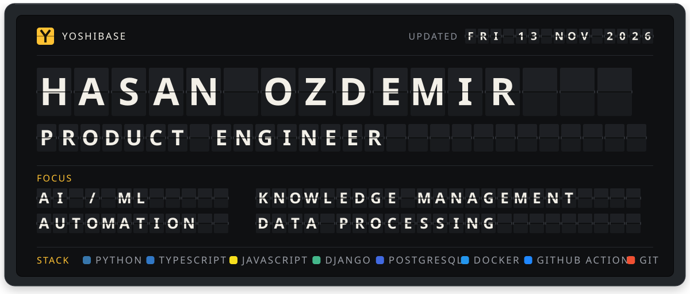
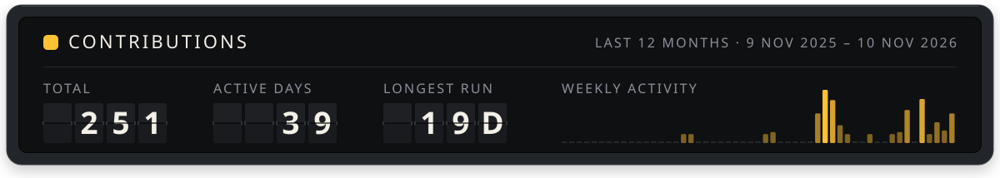
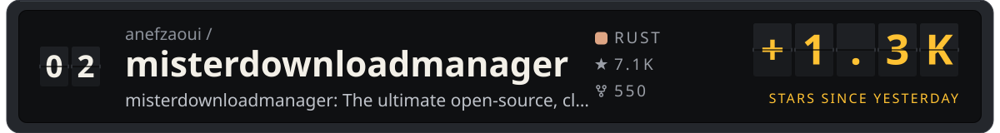
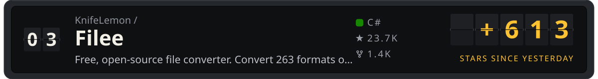
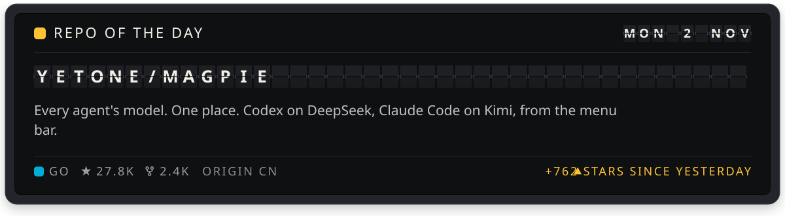

 

&nbsp;
&nbsp;

 

**Product engineer and software evangelist.** I build AI/ML, automation, knowledge-management and data-processing tools: software that makes a meaningful change to how people work.

 

<!--TRENDING_START-->

<!--TRENDING_END-->

 

<!--REPO_OF_DAY_START-->

<b>Departure log</b> · 30 picks over the last 30 days

 

| Date | Repository | Language | Stars | Gained |
|:--|:--|:--|--:|--:|
| Nov 13 | [**kingcharleslzy-ai/dsh-purge**](https://github.com/kingcharleslzy-ai/dsh-purge) dsh-purge Community · DeepSeek Harness 社区维护版：宿主兼容、状态诊断、提示词管理、更新与本机备份回滚。基于小杨 / YuJunZhiXue 的 dsh… | JavaScript | 7.6k | +447 |
| Nov 12 | [**NotRexed/Hookshot**](https://github.com/NotRexed/Hookshot) A Native Recompilation Of The Legend Of Zelda: Ocarina Of Time Nintendo Switch 2 Remake | C++ | 8.0k | +1.3k |
| Nov 11 | [**JuneYaooo/rea-video**](https://github.com/JuneYaooo/rea-video) Reverse-engineer any video, shot by shot: filmed, AI-generated or coded, and how to remake it… | Python | 6.5k | +799 |
| Nov 10 | [**anomalyco/rune**](https://github.com/anomalyco/rune) Rune: Native UI framework | Rust | 6.0k | +655 |
| Nov 9 | [**storytold/craft-anything**](https://github.com/storytold/craft-anything) Craft Anything: understand how any software works, and craft your own. | Rust | 23.0k | +2.1k |
| Nov 8 | [**tangency-labs/solidcraft**](https://github.com/tangency-labs/solidcraft) SolidCraft: an open-source parametric 3D CAD application built in pure Rust. Desktop, web, and… | Rust | 14.8k | +277 |
| Nov 7 | [**Niko1221/Strata**](https://github.com/Niko1221/Strata) Qwen3.8-Flash-Next on any consumer hardware: one-click install for Windows / Linux. Strata infe… | C++ | 41.1k | +465 |
| Nov 6 | [**pengchujin/aerial-tv**](https://github.com/pengchujin/aerial-tv) 给国产电视的一块干净桌面：参照 tvOS 设计的开源 Android TV 桌面，没有广告，开机自动接管。A tvOS-style launcher for Xiaomi, TCL and… | Kotlin | 10.0k | +353 |
| Nov 5 | [**heydamir/unslop**](https://github.com/heydamir/unslop) A Claude skill that turns vibecoded, AI-looking UI into a designed interface | JavaScript | 8.8k | +1.1k |
| Nov 4 | [**ccch1mneyyy/dsh-Go**](https://github.com/ccch1mneyyy/dsh-Go) dsh-go — DeepSeek Harness 装进口袋：手机本机运行，也能遥控你的电脑。 | Dart | 8.0k | +1.8k |
| Nov 3 | [**deepseek-ai/dsh-superagent-prototype**](https://github.com/deepseek-ai/dsh-superagent-prototype) Towards a More Autonomous Agent System | TypeScript | 14.1k | +5.1k |
| Nov 2 | [**yetone/magpie**](https://github.com/yetone/magpie) Every agent's model. One place. Codex on DeepSeek, Claude Code on Kimi, from the menu bar. | Go | 27.8k | +762 |
| Nov 1 | [**Zagitta/gpu-unlock**](https://github.com/Zagitta/gpu-unlock) Your GeForce runs AI at half speed. This fixes it for 20/30/40 series cards. Up to 2× FP16 / BF… | C | 13.9k | +362 |
| Oct 31 | [**HeyPuter/everything**](https://github.com/HeyPuter/everything) We're rebuilding and open-sourcing the world’s software from scratch. | JavaScript | 6.0k | +468 |
| Oct 30 | [**xiaoyang111222/cn-math-taxonomy**](https://github.com/xiaoyang111222/cn-math-taxonomy) 数学（小学到高中）、英语（三年级到高中）、初中物理的知识图谱：1644 个知识点、2403 条先修边、6723 道题，对齐课标，附自适应前置诊断。 | Python | 5.3k | +357 |
| Oct 29 | [**openai/math**](https://github.com/openai/math) | Lean | 16.8k | +710 |
| Oct 28 | [**seedds/nxnative**](https://github.com/seedds/nxnative) Switch games running natively on iPhone, iPad and Mac: an NSP folder becomes an unsigned IPA (N… | Objective-C | 8.0k | +1.7k |
| Oct 27 | [**Gathin23/cleanyourtv**](https://github.com/Gathin23/cleanyourtv) Debloat any Android or Google TV over Wi-Fi and get an Apple TV-style home. | Python | 39.6k | +4.0k |
| Oct 26 | [**simbasjungles/free-my-tv**](https://github.com/simbasjungles/free-my-tv) A fast, ad-free home screen for Google TV, LG webOS and Samsung Tizen. One button to undo. | Java | 4.6k | +315 |
| Oct 25 | [**Jakeschincariol/replica-skill**](https://github.com/Jakeschincariol/replica-skill) Eleven free Claude skills that clone any app: reverse-engineer it, rebuild it, test it for bugs… | Python | 5.3k | +242 |
| Oct 24 | [**yihui-dev/awesome-opus5-5-videos**](https://github.com/yihui-dev/awesome-opus5-5-videos) A growing collection of viral videos made with Claude Opus 5.5 and the prompts behind them. Wat… | — | 9.9k | +624 |
| Oct 23 | [**deepseek-ai/DeepInfer**](https://github.com/deepseek-ai/DeepInfer) DeepInfer: High-performance, large-scale inference framework for DeepSeek models | Python | 20.1k | +1.8k |
| Oct 22 | [**lemomo-ai/lemo-opuscar**](https://github.com/lemomo-ai/lemo-opuscar) Claude Code skill for short films with no video model: 51 film styles, each a style prompt plus… | JavaScript | 5.0k | +548 |
| Oct 21 | [**google-research/harness2**](https://github.com/google-research/harness2) | Python | 15.7k | +3.4k |
| Oct 20 | [**KnifeLemon/Filee**](https://github.com/KnifeLemon/Filee) Free, open-source file converter. Convert 244+ formats offline by drag &amp; drop — images, PDF, Wo… | C# | 6.7k | +2.3k |
| Oct 19 | [**Ebony-Vinyl/dsh-our-free-model**](https://github.com/Ebony-Vinyl/dsh-our-free-model) 在 dsh 里装上这个插件即可，无需登录、注册或填 API Key，就能使用包括 DeepSeek V4.1 Flash、Kimi K3 在内的前沿模型——完全免费，不限量。 All you… | JavaScript | 25.1k | +3.1k |
| Oct 18 | [**wheresryan22/anatomy**](https://github.com/wheresryan22/anatomy) An agent skill for creating detailed, interactive isometric illustrations of real-world machine… | JavaScript | 15.2k | +1.2k |
| Oct 17 | [**Edge0-AI/Edge0**](https://github.com/Edge0-AI/Edge0) Run 35B MoE models in \~2.5 GB of RAM. Weights stream from SSD; a trained router predicts loads… | Python | 5.4k | +216 |
| Oct 16 | [**storytold/cadcraft**](https://github.com/storytold/cadcraft) CADCraft: computer-aided design and drafting — an open-source, clean-room AutoCAD-style app in… | Rust | 5.2k | +319 |
| Oct 15 | [**storytold/effectcraft**](https://github.com/storytold/effectcraft) EffectCraft: An open-source motion graphics and compositing tool written by scratch in pure Rust | Rust | 6.6k | +301 |

<!--REPO_OF_DAY_END-->

<b>How this board works</b> · rebuilt every night by a stdlib-only pipeline

 

GitHub has no trending API, so this page measures velocity itself. Every night at 00:00 UTC a [GitHub Actions workflow](.github/workflows/daily-update.yml) runs four steps:

1. **Measure.** Search repositories created in the last 45 days with 300+ stars, and diff each one against yesterday's star snapshot.
2. **Pick.** The three fastest risers are *trending now*. The *repo of the day* is drawn from the five fastest risers not featured in the last 30 days.
3. **Draw.** Every board on this page is an SVG written by [plain Python](scripts/): split-flap cells, embedded Barlow type, no third-party renderers.
4. **Publish.** This README is re-rendered from a template and committed.

 

<!-- refreshed daily -->
<!--SYNCED_AT_START-->
<!-- synced: 2026-11-13 04:50 UTC -->
<!--SYNCED_AT_END-->
