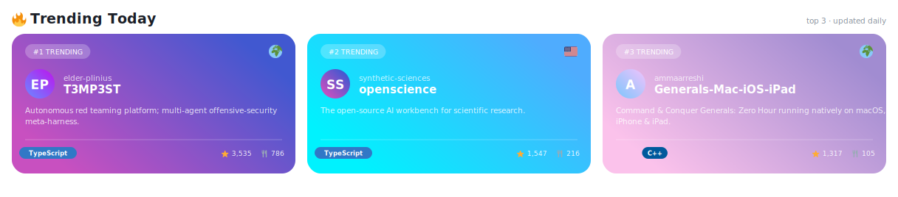
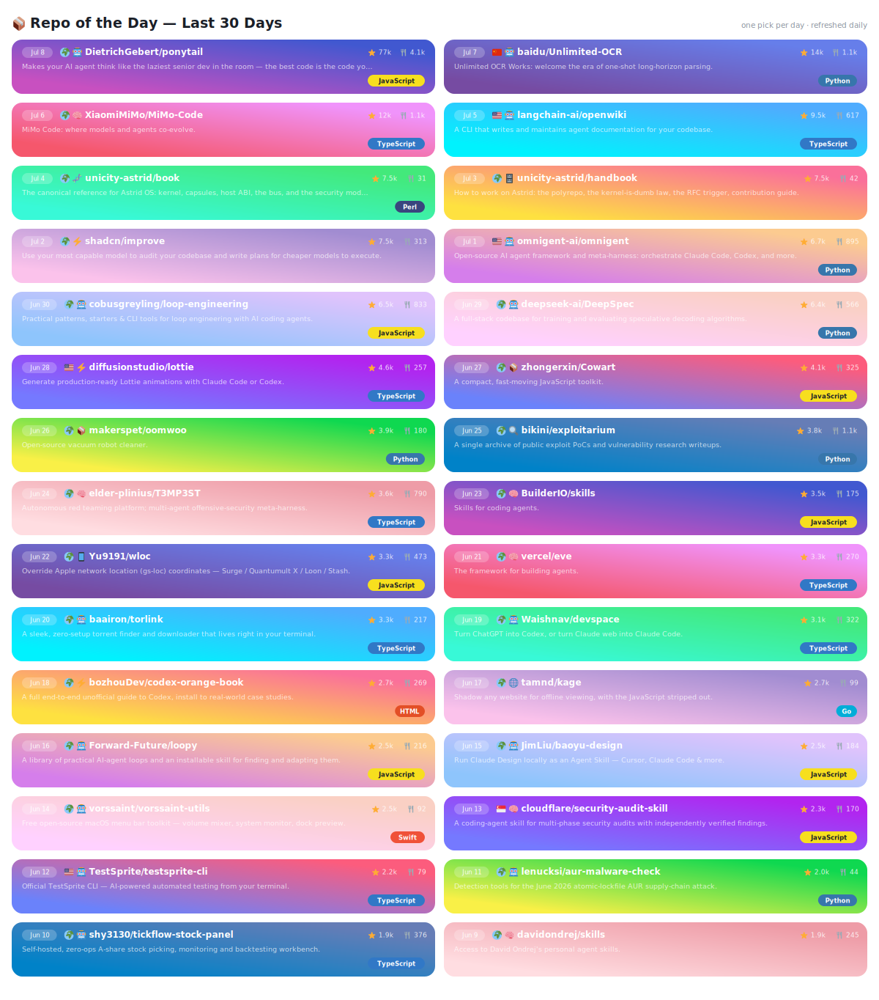

<picture>
  <source media="(prefers-color-scheme: dark)" srcset="assets/generated/banner-header-dark.svg">
  
</picture>

 

&nbsp;
&nbsp;

  

<samp>
<b>Software evangelizer</b> with a passion for AI/ML, Automation, Knowledge Management, Data Processing — committed to building apps and tools that make a meaningful change.
</samp>

  

<picture>
  <source media="(prefers-color-scheme: dark)" srcset="https://streak-stats.demolab.com/?user=yoshibase&theme=radical&hide_border=true&card_width=380&card_height=150">
  
</picture>

 

<picture>
  <source media="(prefers-color-scheme: dark)" srcset="https://skillicons.dev/icons?i=python,js,ts,postgres,django,docker,githubactions,git&theme=dark&perline=8">
  
</picture>

 

<!--TRENDING_START-->

<picture>
  <source media="(prefers-color-scheme: dark)" srcset="assets/generated/trending-dark.svg">
  
</picture>

Links ↗

- [elder-plinius/T3MP3ST](https://github.com/elder-plinius/T3MP3ST) — Autonomous red teaming platform; multi-agent offensive-security meta-harness.
- [synthetic-sciences/openscience](https://github.com/synthetic-sciences/openscience) — The open-source AI workbench for scientific research.
- [ammaarreshi/Generals-Mac-iOS-iPad](https://github.com/ammaarreshi/Generals-Mac-iOS-iPad) — Command & Conquer Generals: Zero Hour running natively on macOS, iPhone & iPad.

<!--TRENDING_END-->

 

<!--REPO_OF_DAY_START-->

<picture>
  <source media="(prefers-color-scheme: dark)" srcset="assets/generated/repo-of-day-dark.svg">
  
</picture>

Links ↗

- `Jul 8` [DietrichGebert/ponytail](https://github.com/DietrichGebert/ponytail) — Makes your AI agent think like the laziest senior dev in the room — the best code is the code you don't write.
- `Jul 7` [baidu/Unlimited-OCR](https://github.com/baidu/Unlimited-OCR) — Unlimited OCR Works: welcome the era of one-shot long-horizon parsing.
- `Jul 6` [XiaomiMiMo/MiMo-Code](https://github.com/XiaomiMiMo/MiMo-Code) — MiMo Code: where models and agents co-evolve.
- `Jul 5` [langchain-ai/openwiki](https://github.com/langchain-ai/openwiki) — A CLI that writes and maintains agent documentation for your codebase.
- `Jul 4` [unicity-astrid/book](https://github.com/unicity-astrid/book) — The canonical reference for Astrid OS: kernel, capsules, host ABI, the bus, and the security model.
- `Jul 3` [unicity-astrid/handbook](https://github.com/unicity-astrid/handbook) — How to work on Astrid: the polyrepo, the kernel-is-dumb law, the RFC trigger, contribution guide.
- `Jul 2` [shadcn/improve](https://github.com/shadcn/improve) — Use your most capable model to audit your codebase and write plans for cheaper models to execute.
- `Jul 1` [omnigent-ai/omnigent](https://github.com/omnigent-ai/omnigent) — Open-source AI agent framework and meta-harness: orchestrate Claude Code, Codex, and more.
- `Jun 30` [cobusgreyling/loop-engineering](https://github.com/cobusgreyling/loop-engineering) — Practical patterns, starters & CLI tools for loop engineering with AI coding agents.
- `Jun 29` [deepseek-ai/DeepSpec](https://github.com/deepseek-ai/DeepSpec) — A full-stack codebase for training and evaluating speculative decoding algorithms.
- `Jun 28` [diffusionstudio/lottie](https://github.com/diffusionstudio/lottie) — Generate production-ready Lottie animations with Claude Code or Codex.
- `Jun 27` [zhongerxin/Cowart](https://github.com/zhongerxin/Cowart) — A compact, fast-moving JavaScript toolkit.
- `Jun 26` [makerspet/oomwoo](https://github.com/makerspet/oomwoo) — Open-source vacuum robot cleaner.
- `Jun 25` [bikini/exploitarium](https://github.com/bikini/exploitarium) — A single archive of public exploit PoCs and vulnerability research writeups.
- `Jun 24` [elder-plinius/T3MP3ST](https://github.com/elder-plinius/T3MP3ST) — Autonomous red teaming platform; multi-agent offensive-security meta-harness.
- `Jun 23` [BuilderIO/skills](https://github.com/BuilderIO/skills) — Skills for coding agents.
- `Jun 22` [Yu9191/wloc](https://github.com/Yu9191/wloc) — Override Apple network location (gs-loc) coordinates — Surge / Quantumult X / Loon / Stash.
- `Jun 21` [vercel/eve](https://github.com/vercel/eve) — The framework for building agents.
- `Jun 20` [baairon/torlink](https://github.com/baairon/torlink) — A sleek, zero-setup torrent finder and downloader that lives right in your terminal.
- `Jun 19` [Waishnav/devspace](https://github.com/Waishnav/devspace) — Turn ChatGPT into Codex, or turn Claude web into Claude Code.
- `Jun 18` [bozhouDev/codex-orange-book](https://github.com/bozhouDev/codex-orange-book) — A full end-to-end unofficial guide to Codex, install to real-world case studies.
- `Jun 17` [tamnd/kage](https://github.com/tamnd/kage) — Shadow any website for offline viewing, with the JavaScript stripped out.
- `Jun 16` [Forward-Future/loopy](https://github.com/Forward-Future/loopy) — A library of practical AI-agent loops and an installable skill for finding and adapting them.
- `Jun 15` [JimLiu/baoyu-design](https://github.com/JimLiu/baoyu-design) — Run Claude Design locally as an Agent Skill — Cursor, Claude Code & more.
- `Jun 14` [vorssaint/vorssaint-utils](https://github.com/vorssaint/vorssaint-utils) — Free open-source macOS menu bar toolkit — volume mixer, system monitor, dock preview.
- `Jun 13` [cloudflare/security-audit-skill](https://github.com/cloudflare/security-audit-skill) — A coding-agent skill for multi-phase security audits with independently verified findings.
- `Jun 12` [TestSprite/testsprite-cli](https://github.com/TestSprite/testsprite-cli) — Official TestSprite CLI — AI-powered automated testing from your terminal.
- `Jun 11` [lenucksi/aur-malware-check](https://github.com/lenucksi/aur-malware-check) — Detection tools for the June 2026 atomic-lockfile AUR supply-chain attack.
- `Jun 10` [shy3130/tickflow-stock-panel](https://github.com/shy3130/tickflow-stock-panel) — Self-hosted, zero-ops A-share stock picking, monitoring and backtesting workbench.
- `Jun 9` [davidondrej/skills](https://github.com/davidondrej/skills) — Access to David Ondrej's personal agent skills.

Last synced Jul 8, 2026 · automated daily

<!--REPO_OF_DAY_END-->

 

<picture>
  <source media="(prefers-color-scheme: dark)" srcset="assets/generated/banner-footer-dark.svg">
  
</picture>
